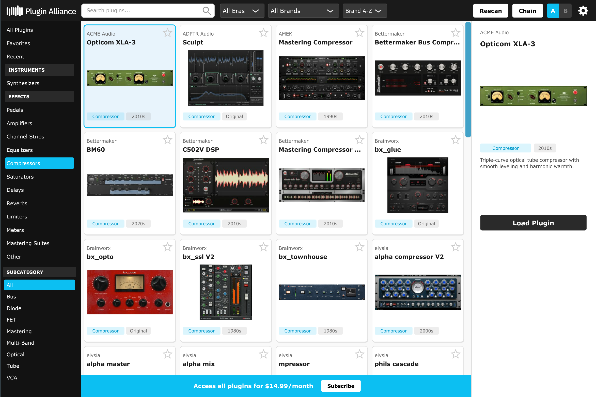
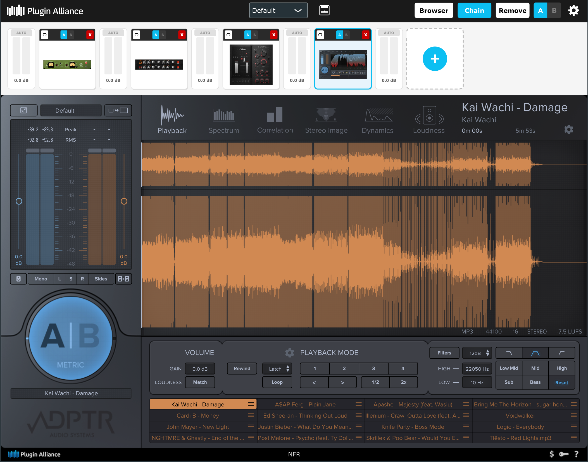

# Plugin Alliance Launcher

A VST3/AU plugin built with the JUCE framework that provides a searchable browser for the entire Plugin Alliance catalog directly inside your DAW. Browse, load, and chain plugins without leaving your session.

## Features

- **Plugin Browser** - Search and filter 150+ Plugin Alliance plugins by category, subcategory, era, and brand
- **8-Slot Plugin Chain** - Load plugins into a serial processing chain with per-slot bypass, reordering, and gain control
- **A/B Comparison** - Each chain slot has independent A and B hosts, letting you load two different plugins and toggle between them
- **Auto-Gain (LUFS Matching)** - Automatic loudness-matched output per slot using ITU-R BS.1770 K-weighted LUFS measurement, removing the "louder = better" bias when comparing plugins
- **L/R Peak Meters** - Per-slot stereo metering with visual gain staging
- **Favorites and Recents** - Quick access to your most-used plugins
- **Preset Management** - Save and recall full chain configurations
- **Offline Thumbnails** - All plugin images are embedded in the binary for instant browsing with no network dependency

## Plugin Formats

| Format | Platform |
|--------|----------|
| VST3 | Windows, macOS |
| AU | macOS |
| Standalone | Windows, macOS |

## Building

### Requirements

- [JUCE](https://juce.com/) framework
- **Windows:** Visual Studio 2022
- **macOS:** Xcode

### Build Steps

1. Open `PluginAllianceLauncher.jucer` in Projucer
2. Export to your IDE (Visual Studio or Xcode)
3. Build the desired target (VST3, AU, or Standalone)

## Tech Stack

- **C++17** with the JUCE audio application framework
- **JSON** plugin database with 150+ entries
- **XML** state/preset serialization
- **Python** tooling for fetching plugin metadata and images from Plugin Alliance
